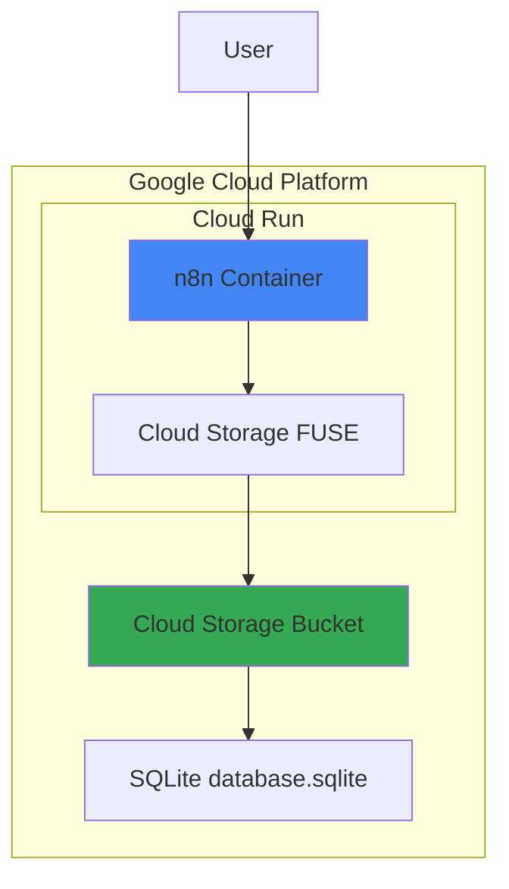

# Cloud Run + SQLite構成 完全実装ガイド

## 目次

1. [概要](#概要)
2. [アーキテクチャ](#アーキテクチャ)
3. [前提条件と制限事項](#前提条件と制限事項)
4. [環境構築手順](#環境構築手順)
5. [デプロイメント](#デプロイメント)
6. [設定とカスタマイズ](#設定とカスタマイズ)
7. [運用とメンテナンス](#運用とメンテナンス)
8. [トラブルシューティング](#トラブルシューティング)
9. [参考資料](#参考資料)

## 概要

このドキュメントでは、Google Cloud RunでSQLiteデータベースを使用したn8nの構築方法を詳細に説明します。2024年3月にリリースされたCloud Run Volume Mounts機能を使用して、Cloud StorageバケットをFUSE経由でマウントし、SQLiteデータベースを永続化します。

### 想定読者

- Google Cloudの基本的な知識がある方
- n8nを個人利用で運用したい方
- 月額費用を最小限に抑えたい方

### 重要な警告 ⚠️

この構成には重大な制限事項があります。本番環境や重要なデータを扱う場合は使用しないでください。

## アーキテクチャ



### コンポーネント説明

| コンポーネント     | 説明                             | 役割                                                |
| ------------------ | -------------------------------- | --------------------------------------------------- |
| Cloud Run          | サーバーレスコンテナ実行環境     | n8nアプリケーションのホスティング                   |
| Cloud Storage FUSE | ファイルシステムインターフェース | Cloud StorageをPOSIX風ファイルシステムとして提供    |
| Cloud Storage      | オブジェクトストレージ           | SQLiteデータベースファイルの永続化                  |
| SQLite             | 軽量データベース                 | n8nのデータ（ワークフロー、認証情報、実行履歴）保存 |

## 前提条件と制限事項

### 前提条件

- Google Cloudアカウント（請求先アカウント設定済み）
- gcloud CLIインストール済み
- Docker（ローカルテスト用、オプション）
- 基本的なLinuxコマンドの知識

### 重要な制限事項

#### 1. ファイルロッキングの欠如

```
⚠️ Cloud Storage FUSEは同時書き込み制御を提供しません
- 複数の書き込みが競合した場合、データが失われる可能性
- SQLiteのロック機構が正しく動作しない
```

#### 2. パフォーマンスの制約

```
📊 ベンチマーク結果（参考値）
- ローカルSQLite: クエリ実行 5秒
- Cloud Storage FUSE上: 同じクエリ 300-500秒（60-100倍遅い）
```

#### 3. POSIX準拠の問題

```
🔧 Cloud Storage FUSEは完全なPOSIX準拠ではない
- 一部のファイルシステム操作が期待通り動作しない
- SQLiteの高度な機能が使用できない場合がある
```

### 推奨使用条件

✅ **使用可能な場合**

- 個人の学習・実験環境
- データロスを許容できる軽い自動化
- 月間実行回数が100回以下
- 同時実行が発生しない

❌ **使用を避けるべき場合**

- 本番環境
- ビジネスクリティカルなワークフロー
- 複数ユーザーでの共有利用
- 高頻度実行（1日10回以上）

## 環境構築手順

### 1. プロジェクトの準備

```bash
# プロジェクトIDの設定（your-project-idを実際のIDに置き換え）
export PROJECT_ID="your-project-id"
export REGION="us-central1"  # 無料枠対象リージョン
export SERVICE_NAME="n8n"
export BUCKET_NAME="${PROJECT_ID}-n8n-data"

# プロジェクトの設定
gcloud config set project ${PROJECT_ID}

# 必要なAPIの有効化
gcloud services enable run.googleapis.com
gcloud services enable cloudbuild.googleapis.com
gcloud services enable storage.googleapis.com
gcloud services enable artifactregistry.googleapis.com
```

### 2. Cloud Storageバケットの作成

```bash
# バケット作成（無料枠対象リージョン）
gsutil mb -p ${PROJECT_ID} -l ${REGION} -c standard gs://${BUCKET_NAME}

# バケットのライフサイクル設定（古いバックアップの自動削除）
cat > lifecycle.json << EOF
{
  "lifecycle": {
    "rule": [
      {
        "action": {"type": "Delete"},
        "condition": {
          "age": 30,
          "matchesPrefix": ["backups/"]
        }
      }
    ]
  }
}
EOF

gsutil lifecycle set lifecycle.json gs://${BUCKET_NAME}
```

### 3. サービスアカウントの設定

```bash
# Cloud Run用サービスアカウントの作成
gcloud iam service-accounts create n8n-runner \
  --display-name="n8n Cloud Run Service Account"

# 必要な権限の付与
gcloud projects add-iam-policy-binding ${PROJECT_ID} \
  --member="serviceAccount:n8n-runner@${PROJECT_ID}.iam.gserviceaccount.com" \
  --role="roles/storage.admin"

gcloud projects add-iam-policy-binding ${PROJECT_ID} \
  --member="serviceAccount:n8n-runner@${PROJECT_ID}.iam.gserviceaccount.com" \
  --role="roles/run.invoker"
```

### 4. カスタムDockerイメージの作成（オプション）

```dockerfile
# Dockerfile
FROM n8nio/n8n:latest

# タイムゾーン設定
ENV TZ=Asia/Tokyo
RUN ln -snf /usr/share/zoneinfo/$TZ /etc/localtime && echo $TZ > /etc/timezone

# SQLite最適化用のスクリプト
COPY sqlite-optimize.sh /docker-entrypoint.d/
RUN chmod +x /docker-entrypoint.d/sqlite-optimize.sh

# ヘルスチェック
HEALTHCHECK --interval=30s --timeout=5s --start-period=30s --retries=3 \
  CMD curl -f http://localhost:5678/healthz || exit 1

# 非rootユーザーで実行
USER node
```

```bash
# sqlite-optimize.sh
#!/bin/sh
# SQLiteの最適化設定
if [ -f /home/node/.n8n/database.sqlite ]; then
    sqlite3 /home/node/.n8n/database.sqlite <<EOF
PRAGMA journal_mode = DELETE;
PRAGMA synchronous = NORMAL;
PRAGMA cache_size = -64000;
PRAGMA temp_store = MEMORY;
VACUUM;
EOF
fi
```

## デプロイメント

### 1. 基本的なデプロイ

```bash
# 環境変数の準備
export N8N_ENCRYPTION_KEY=$(openssl rand -hex 16)
export N8N_BASIC_AUTH_USER="admin"
export N8N_BASIC_AUTH_PASSWORD=$(openssl rand -base64 12)

# デプロイコマンド
gcloud run deploy ${SERVICE_NAME} \
  --image docker.n8n.io/n8nio/n8n:latest \
  --region ${REGION} \
  --platform managed \
  --memory 1Gi \
  --cpu 1 \
  --min-instances 0 \
  --max-instances 1 \
  --concurrency 1 \
  --timeout 300 \
  --service-account "n8n-runner@${PROJECT_ID}.iam.gserviceaccount.com" \
  --set-env-vars "DB_TYPE=sqlite" \
  --set-env-vars "DB_SQLITE_DATABASE=/home/node/.n8n/database.sqlite" \
  --set-env-vars "N8N_ENCRYPTION_KEY=${N8N_ENCRYPTION_KEY}" \
  --set-env-vars "N8N_BASIC_AUTH_ACTIVE=true" \
  --set-env-vars "N8N_BASIC_AUTH_USER=${N8N_BASIC_AUTH_USER}" \
  --set-env-vars "N8N_BASIC_AUTH_PASSWORD=${N8N_BASIC_AUTH_PASSWORD}" \
  --set-env-vars "N8N_HOST=n8n-${PROJECT_ID}.${REGION}.run.app" \
  --set-env-vars "N8N_PROTOCOL=https" \
  --set-env-vars "WEBHOOK_URL=https://n8n-${PROJECT_ID}.${REGION}.run.app/" \
  --allow-unauthenticated

# 認証情報を保存
echo "=== n8n Access Credentials ===" > n8n-credentials.txt
echo "URL: https://n8n-${PROJECT_ID}.${REGION}.run.app" >> n8n-credentials.txt
echo "Username: ${N8N_BASIC_AUTH_USER}" >> n8n-credentials.txt
echo "Password: ${N8N_BASIC_AUTH_PASSWORD}" >> n8n-credentials.txt
echo "Encryption Key: ${N8N_ENCRYPTION_KEY}" >> n8n-credentials.txt
echo "=============================" >> n8n-credentials.txt
cat n8n-credentials.txt
```

### 2. ボリュームマウントの追加

```bash
# Cloud Storageボリュームのマウント
gcloud beta run services update ${SERVICE_NAME} \
  --region ${REGION} \
  --execution-environment gen2 \
  --add-volume name=n8n-data,type=cloud-storage,bucket=${BUCKET_NAME},\
mount-options="metadata-cache-ttl-secs=300;stat-cache-max-size-mb=64;type-cache-max-size-mb=8" \
  --add-volume-mount volume=n8n-data,mount-path=/home/node/.n8n
```

### 3. カスタムドメインの設定（オプション）

```bash
# ドメインマッピングの作成
gcloud run domain-mappings create \
  --service ${SERVICE_NAME} \
  --domain n8n.yourdomain.com \
  --region ${REGION}

# DNSレコードの確認
gcloud run domain-mappings describe \
  --domain n8n.yourdomain.com \
  --region ${REGION}
```

## 設定とカスタマイズ

### 1. パフォーマンス最適化設定

```yaml
# cloud-run-config.yaml
apiVersion: serving.knative.dev/v1
kind: Service
metadata:
  name: n8n
  annotations:
    run.googleapis.com/launch-stage: BETA
spec:
  template:
    metadata:
      annotations:
        run.googleapis.com/execution-environment: gen2
        autoscaling.knative.dev/minScale: "0"
        autoscaling.knative.dev/maxScale: "1"
        run.googleapis.com/cpu-throttling: "false"
    spec:
      containerConcurrency: 1 # 重要: 同時実行を防ぐ
      timeoutSeconds: 300
      serviceAccountName: n8n-runner@${PROJECT_ID}.iam.gserviceaccount.com
      containers:
        - image: docker.n8n.io/n8nio/n8n:latest
          resources:
            limits:
              cpu: "1"
              memory: "1Gi"
          env:
            - name: DB_TYPE
              value: "sqlite"
            - name: DB_SQLITE_DATABASE
              value: "/home/node/.n8n/database.sqlite"
          volumeMounts:
            - name: n8n-data
              mountPath: /home/node/.n8n
      volumes:
        - name: n8n-data
          csi:
            driver: gcsfuse.run.googleapis.com
            volumeAttributes:
              bucketName: ${BUCKET_NAME}
              mountOptions: |
                metadata-cache-ttl-secs=300
                stat-cache-max-size-mb=64
                type-cache-max-size-mb=8
                implicit-dirs=true
                only-dir=n8n-data
```

### 2. SQLite最適化設定

```sql
-- SQLite設定スクリプト (optimize.sql)
-- ジャーナルモードの設定（WALは使用しない）
PRAGMA journal_mode = DELETE;

-- 同期モードの設定（パフォーマンス向上）
PRAGMA synchronous = NORMAL;

-- キャッシュサイズの設定（64MB）
PRAGMA cache_size = -64000;

-- 一時ストレージをメモリに設定
PRAGMA temp_store = MEMORY;

-- 自動バキューム設定
PRAGMA auto_vacuum = INCREMENTAL;

-- ページサイズの最適化
PRAGMA page_size = 4096;

-- インデックスの再構築
REINDEX;

-- データベースの最適化
VACUUM;
ANALYZE;
```

### 3. 環境変数の詳細設定

```bash
# 環境変数設定スクリプト (set-env-vars.sh)
#!/bin/bash

# 基本設定
gcloud run services update ${SERVICE_NAME} \
  --region ${REGION} \
  --update-env-vars \
    "N8N_LOG_LEVEL=warn",\
    "N8N_DIAGNOSTICS_ENABLED=false",\
    "N8N_PERSONALIZATION_ENABLED=false",\
    "N8N_VERSION_NOTIFICATIONS_ENABLED=false",\
    "N8N_TEMPLATES_ENABLED=true",\
    "N8N_METRICS=false",\
    "N8N_WORKFLOW_TAGS_DISABLED=false",\
    "EXECUTIONS_DATA_SAVE_ON_ERROR=all",\
    "EXECUTIONS_DATA_SAVE_ON_SUCCESS=all",\
    "EXECUTIONS_DATA_SAVE_ON_PROGRESS=false",\
    "EXECUTIONS_DATA_SAVE_MANUAL_EXECUTIONS=true",\
    "GENERIC_TIMEZONE=Asia/Tokyo"

# セキュリティ設定
gcloud run services update ${SERVICE_NAME} \
  --region ${REGION} \
  --update-env-vars \
    "N8N_BASIC_AUTH_ACTIVE=true",\
    "N8N_BASIC_AUTH_HASH=true",\
    "N8N_JWT_AUTH_ACTIVE=false",\
    "N8N_DISABLE_PRODUCTION_MAIN_PROCESS=false"

# パフォーマンス設定
gcloud run services update ${SERVICE_NAME} \
  --region ${REGION} \
  --update-env-vars \
    "N8N_CONCURRENCY_PRODUCTION_LIMIT=5",\
    "N8N_PAYLOAD_SIZE_MAX=16",\
    "NODE_OPTIONS=--max-old-space-size=960"
```

## 運用とメンテナンス

### 1. バックアップ戦略

```bash
#!/bin/bash
# backup-n8n.sh - 日次バックアップスクリプト

PROJECT_ID="your-project-id"
BUCKET_NAME="${PROJECT_ID}-n8n-data"
BACKUP_BUCKET="${PROJECT_ID}-n8n-backups"
DATE=$(date +%Y%m%d-%H%M%S)

# バックアップバケットの作成（初回のみ）
gsutil mb -p ${PROJECT_ID} -l ${REGION} gs://${BACKUP_BUCKET} 2>/dev/null || true

# SQLiteデータベースのバックアップ
echo "Starting backup at ${DATE}"

# Cloud Storageから直接コピー（整合性に注意）
gsutil cp gs://${BUCKET_NAME}/database.sqlite \
  gs://${BACKUP_BUCKET}/backups/database-${DATE}.sqlite

# バックアップの検証
gsutil ls -l gs://${BACKUP_BUCKET}/backups/database-${DATE}.sqlite

# 古いバックアップの削除（30日以上）
gsutil ls gs://${BACKUP_BUCKET}/backups/ | \
  while read backup; do
    backup_date=$(echo $backup | grep -oP '\d{8}' | head -1)
    if [ ! -z "$backup_date" ]; then
      days_old=$(( ($(date +%s) - $(date -d $backup_date +%s)) / 86400 ))
      if [ $days_old -gt 30 ]; then
        echo "Deleting old backup: $backup"
        gsutil rm $backup
      fi
    fi
  done

echo "Backup completed"
```

### 2. モニタリング設定

```bash
# Cloud Monitoringアラートの設定
gcloud alpha monitoring policies create \
  --notification-channels=YOUR_CHANNEL_ID \
  --display-name="n8n High Memory Usage" \
  --condition-display-name="Memory > 80%" \
  --condition-type=threshold \
  --condition-metric-type="run.googleapis.com/container/memory/utilizations" \
  --condition-threshold-value=0.8 \
  --condition-threshold-duration=300s

# ログベースメトリクスの作成
gcloud logging metrics create n8n_errors \
  --description="n8n error count" \
  --log-filter='resource.type="cloud_run_revision"
    resource.labels.service_name="n8n"
    severity>=ERROR'
```

### 3. 定期メンテナンススクリプト

```bash
#!/bin/bash
# maintenance.sh - 週次メンテナンススクリプト

# データベースの最適化
echo "Optimizing SQLite database..."
gcloud run services update ${SERVICE_NAME} \
  --region ${REGION} \
  --command="/bin/sh","-c","sqlite3 /home/node/.n8n/database.sqlite 'VACUUM; ANALYZE;'"

# 実行履歴のクリーンアップ（30日以上前のデータを削除）
cat > cleanup.sql << EOF
DELETE FROM execution_entity
WHERE startedAt < datetime('now', '-30 days');

DELETE FROM execution_data
WHERE executionId NOT IN (SELECT id FROM execution_entity);

VACUUM;
EOF

# 一時的なメンテナンスジョブとして実行
gcloud run jobs create n8n-maintenance \
  --image docker.n8n.io/n8nio/n8n:latest \
  --region ${REGION} \
  --parallelism 1 \
  --task-count 1 \
  --max-retries 0 \
  --service-account "n8n-runner@${PROJECT_ID}.iam.gserviceaccount.com" \
  --set-env-vars "DB_TYPE=sqlite" \
  --command="/bin/sh","-c","cat /tmp/cleanup.sql | sqlite3 /home/node/.n8n/database.sqlite"

# ジョブの実行
gcloud run jobs execute n8n-maintenance --region ${REGION}
```

### 4. スケーリング制御

```bash
# 使用率に基づく自動スケーリング設定
gcloud run services update ${SERVICE_NAME} \
  --region ${REGION} \
  --min-instances 0 \
  --max-instances 1 \
  --concurrency 1 \
  --cpu-throttling \
  --update-annotations "autoscaling.knative.dev/target-utilization-percentage=70"

# 時間帯によるスケジュール設定（Cloud Scheduler使用）
# 平日日中のみ起動
gcloud scheduler jobs create http scale-up-n8n \
  --location=${REGION} \
  --schedule="0 8 * * 1-5" \
  --uri="https://run.googleapis.com/apis/serving.knative.dev/v1/namespaces/${PROJECT_ID}/services/${SERVICE_NAME}" \
  --http-method=PATCH \
  --headers="Content-Type=application/json" \
  --message-body='{"spec":{"template":{"metadata":{"annotations":{"autoscaling.knative.dev/minScale":"1"}}}}}'

gcloud scheduler jobs create http scale-down-n8n \
  --location=${REGION} \
  --schedule="0 19 * * 1-5" \
  --uri="https://run.googleapis.com/apis/serving.knative.dev/v1/namespaces/${PROJECT_ID}/services/${SERVICE_NAME}" \
  --http-method=PATCH \
  --headers="Content-Type=application/json" \
  --message-body='{"spec":{"template":{"metadata":{"annotations":{"autoscaling.knative.dev/minScale":"0"}}}}}'
```

## トラブルシューティング

### 1. よくある問題と解決方法

#### データベースロックエラー

```
Error: database is locked
```

**原因**: 同時実行による競合
**解決策**:

```bash
# 同時実行数を1に制限
gcloud run services update ${SERVICE_NAME} \
  --region ${REGION} \
  --concurrency 1

# リトライロジックの実装
export PRAGMA_BUSY_TIMEOUT=30000  # 30秒
```

#### メモリ不足エラー

```
Error: JavaScript heap out of memory
```

**原因**: データベースサイズが大きすぎる
**解決策**:

```bash
# メモリ制限を増やす
gcloud run services update ${SERVICE_NAME} \
  --region ${REGION} \
  --memory 2Gi \
  --update-env-vars "NODE_OPTIONS=--max-old-space-size=1920"
```

#### マウントエラー

```
Error: failed to mount Cloud Storage bucket
```

**原因**: 権限不足またはバケットが存在しない
**解決策**:

```bash
# 権限の確認
gcloud projects get-iam-policy ${PROJECT_ID} \
  --flatten="bindings[].members" \
  --filter="bindings.members:serviceAccount:n8n-runner@${PROJECT_ID}.iam.gserviceaccount.com"

# バケットの存在確認
gsutil ls gs://${BUCKET_NAME}
```

### 2. デバッグ方法

```bash
# ログの確認
gcloud run services logs read ${SERVICE_NAME} \
  --region ${REGION} \
  --limit 100

# リアルタイムログ
gcloud run services logs tail ${SERVICE_NAME} \
  --region ${REGION}

# デバッグモードの有効化
gcloud beta run services update ${SERVICE_NAME} \
  --region ${REGION} \
  --add-volume name=n8n-data,type=cloud-storage,bucket=${BUCKET_NAME},\
mount-options="log-severity=debug"

# SQLiteデータベースの直接確認
gsutil cp gs://${BUCKET_NAME}/database.sqlite /tmp/
sqlite3 /tmp/database.sqlite "PRAGMA integrity_check;"
```

### 3. パフォーマンスチューニング

```bash
# Cloud Storage FUSEのキャッシュ設定最適化
gcloud beta run services update ${SERVICE_NAME} \
  --region ${REGION} \
  --add-volume name=n8n-data,type=cloud-storage,bucket=${BUCKET_NAME},\
mount-options="metadata-cache-ttl-secs=600;\
stat-cache-max-size-mb=128;\
type-cache-max-size-mb=16;\
max-conns-per-host=100;\
max-idle-conns-per-host=100"

# ネットワーク最適化（Private Service Connect使用）
gcloud compute networks vpc-access connectors create n8n-connector \
  --region=${REGION} \
  --subnet=default \
  --min-instances=2 \
  --max-instances=3

gcloud run services update ${SERVICE_NAME} \
  --region ${REGION} \
  --vpc-connector=n8n-connector \
  --vpc-egress=private-ranges-only
```

## 参考資料

### 公式ドキュメント

1. **Google Cloud Run**

   - [Cloud Run ドキュメント](https://cloud.google.com/run/docs)
   - [Cloud Run Volume Mounts](https://cloud.google.com/run/docs/configuring/services/cloud-storage-volume-mounts)
   - [Cloud Run 料金](https://cloud.google.com/run/pricing)

2. **Cloud Storage FUSE**

   - [Cloud Storage FUSE 概要](https://cloud.google.com/storage/docs/gcs-fuse)
   - [FUSE マウントオプション](https://cloud.google.com/storage/docs/gcsfuse-cli#options)
   - [FUSE パフォーマンス最適化](https://cloud.google.com/storage/docs/gcsfuse-performance)

3. **n8n**
   - [n8n 公式ドキュメント](https://docs.n8n.io/)
   - [n8n 環境変数](https://docs.n8n.io/reference/environment-variables/)
   - [n8n データベース設定](https://docs.n8n.io/hosting/configuration/supported-databases-settings/)

### コミュニティリソース

1. **GitHub リポジトリ**

   - [n8n-cloudrun-example](https://github.com/luke-lewandowski/n8n-cloudrun-example)
   - [self-host-n8n-on-gcr](https://github.com/datawranglerai/self-host-n8n-on-gcr)

2. **ブログ記事**

   - [Introducing Cloud Run volume mounts (Google Cloud Blog)](https://cloud.google.com/blog/products/serverless/introducing-cloud-run-volume-mounts)
   - [How to Deploy a Serverless Database with Cloud Run](https://www.wallacesharpedavidson.nz/post/sqlite-cloudrun/)

3. **フォーラムディスカッション**
   - [n8n Community - SQLite使用に関する議論](https://community.n8n.io/t/accessing-the-internal-sqlite-storage/1860)
   - [Stack Overflow - Cloud Run永続ストレージ](https://stackoverflow.com/questions/64228967/how-to-mount-persistent-storage-to-google-cloud-run)

### 関連ツール

1. **SQLite管理ツール**

   - [SQLite Browser](https://sqlitebrowser.org/)
   - [DBeaver](https://dbeaver.io/)

2. **モニタリングツール**

   - [Google Cloud Monitoring](https://cloud.google.com/monitoring)
   - [Google Cloud Logging](https://cloud.google.com/logging)

3. **開発ツール**
   - [gcloud CLI](https://cloud.google.com/sdk/gcloud)
   - [Cloud Shell](https://cloud.google.com/shell)

### セキュリティベストプラクティス

1. **アクセス制御**

   ```bash
   # IAMによるアクセス制限
   gcloud run services add-iam-policy-binding ${SERVICE_NAME} \
     --region=${REGION} \
     --member="user:your-email@example.com" \
     --role="roles/run.invoker"

   # 認証を必須に変更
   gcloud run services update ${SERVICE_NAME} \
     --region ${REGION} \
     --no-allow-unauthenticated
   ```

2. **暗号化**

   - Cloud Storage: デフォルトで保存時暗号化
   - 転送時: HTTPS による暗号化
   - n8n: N8N_ENCRYPTION_KEY による認証情報の暗号化

3. **監査ログ**
   ```bash
   # Cloud Audit Logsの有効化
   gcloud projects add-iam-policy-binding ${PROJECT_ID} \
     --member="serviceAccount:service-${PROJECT_NUMBER}@container-engine-robot.iam.gserviceaccount.com" \
     --role="roles/logging.logWriter"
   ```

## まとめ

Cloud Run + SQLite構成は、技術的には実現可能ですが、以下の点に注意が必要です：

### ✅ メリット

- 極めて低コスト（月額0-100円）
- サーバーレスで管理不要
- 自動スケーリング

### ⚠️ デメリット

- ファイルロッキングの欠如によるデータ破損リスク
- パフォーマンスの大幅な低下
- 同時実行ができない

### 📌 推奨事項

1. **本番環境では使用しない**
2. **個人の実験・学習用途に限定**
3. **重要なデータは別途バックアップ**
4. **可能であればCompute Engine + SQLiteまたはCloud SQL を検討**

この構成は「動作はするが推奨はしない」というのが正直な評価です。技術的な興味や極限までコストを削減したい場合には試す価値がありますが、実用的な運用には適していません。
